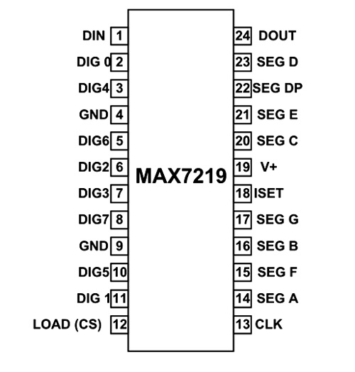
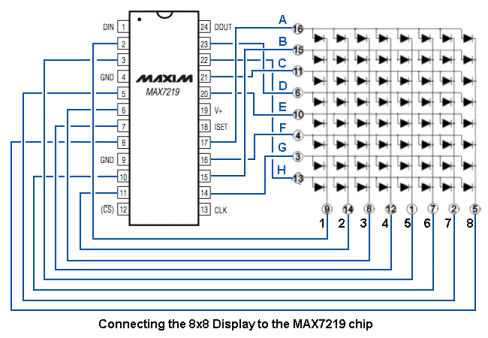

# Dot Matrix Tester

I plan on making a custom PCB implementing what I have prototyped in
https://github.com/tomashubelbauer/arduino-qr.

I want to start small and slow. The first step will be to wire up a MAX7219 LED
display driver to an 8x8 dot matrix display.

I could reverse engineer a breakout board, but I have found reference images
which I think will suffice.

MAX7219 pinout:

MAX7219 connection to an 8x8 dot matrix LED display:

The datasheet for the IC:
https://datasheets.maximintegrated.com/en/ds/MAX7219-MAX7221.pdf

I started by making a new KiCad project and I added the MAX7219 part from the
default library. KiCad doesn't seem to be shipping with a component for the 8x8
dot matrix LED display, so I will have to make my own.

I also prototype the code on Wokwi, the online Arduino simulator:
- https://wokwi.com/projects/330377477619712594
- https://wokwi.com/projects/330373550359708244

In the sketches, I am using a breakout board component. My first step will be to
make my own one which will be compatible with the same sketch.

The long term plan is to go from having designed the breakout board to designing
a PBC with the ATMega IC and the MAX7219 on-board and with a 6x6 grid of the dot
matrix displays. The IC would be programmed with the QR code sketch:

https://wokwi.com/arduino/projects/297148152803230218

There would also be a Bluetooth chip and I will have a companion application to
send new text to be displayed as QR on the dot matrix display grid. To secure
the BT communication channel, I will use HOTP to sign the messages to the board
and the board will reject any messages which do not have the right TOTP payload.
